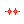

# Pixel Art Collection Quick Starter - Generate Algorithmically Your Own Curated (or Randomized) Collection


Let's start and generate algorithmically a pixel art collection in three steps:

Step 1 - Generate A List of Your Pixel Art Collection in a Tabular Text Format (Spreadsheet)

Step 2 - Generate All Pixel Art Images in Original Format and In 20x

Step 3 - Bonus: Generate an All-In-One Composite Image


## Collection №1 -  Twenty-Five Dodge Pixel Art Punks

Let's start with an exclusive twenty-five Shiba Inu dogs
pixel art collection. Much wow. Super rare.

Let's copy and (re)use all punk (building) blocks
in the dodge series (24x24):

Classic ,
Dark ,
Zombie ,
Alien 


Attributes -
Crazy Hair ,
Beanie ,
Cap  ,
Cap Forward ,
Knitted Cap ,
Fedora ,
Cowboy Hat ,
Top Hat ,
Bandana ,
Headband ,
Regular Shades  ,
Classic Shades ,
Small Shades  ,
Big Shades  ,
Eye Patch   ,
Nerd Glasses  ,
3D Glasses ,
Tiara 


(Source: [Punk (Building) Blocks - Dodge Series (24x24)](https://github.com/cryptopunksnotdead/punks.blocks#dodge-series-24x24))


### Step 1 -  Generate A List of Your Pixel Art Collection in Tabular Text Format (Spreadsheet)

In the first sample let's generate the list of the pixel art collection
by hand. Let's use a rarity & popularity distribution of
10 classic Shibas, 7 darkies, 5 zombies and 3 aliens.  Example  -  [`dodge.csv`](no1/dodge.csv):

``` csv
type,       attribute1,   attribute2
Classic,    3D Glasses
Classic,    Beanie
Classic,    Cap,          Regular Shades
Classic,    Cowboy Hat
Classic,    Eye Patch
Classic,    Knitted Cap
Classic,    Nerd Glasses
Classic,    Big Shades
Classic,    Knitted Cap,  Regular Shades
Classic
Dark,       Tiara
Dark,       Big Shades
Dark,       3D Glasses
Dark,       Classic Shades
Dark,       Cap
Dark,       Cap,          Regular Shades
Dark,       Tiara,        Big Shades
Zombie,     Knitted Cap
Zombie,     Eye Patch
Zombie,     Regular Shades
Zombie,     Knitted Cap,  Regular Shades
Zombie
Alien,      Cap,          Small Shades
Alien,      Headband
Alien,      Classic Shades
```

Yes, that's it.
For the list format let's use the comma-separated values (.CSV) format supported by all spreadsheet programs.
Every line is a record of a punk
made up of the basic type  and one or more attributes.

Note: Let's NOT add the index number (0,1,2,3, and so on).
Why? That way you can easily
reshuffle your collection anytime.
Let's try a more "random" look by hand:


``` csv
type,       attribute1,   attribute2
Classic,    3D Glasses
Dark,       Tiara
Classic,    Beanie
Zombie,     Knitted Cap
Alien,      Cap,          Small Shades
Dark,       Big Shades
Zombie,     Eye Patch
Classic,    Cap,          Regular Shades
Classic,    Cowboy Hat
Classic,    Eye Patch
Alien,      Headband
Classic,    Knitted Cap
Dark,       3D Glasses
Zombie,     Regular Shades
Classic,    Nerd Glasses
Classic,    Big Shades
Dark,       Cap
Zombie
Classic,    Knitted Cap,  Regular Shades
Classic
Dark,       Classic Shades
Dark,       Cap,          Regular Shades
Alien,      Classic Shades
Dark,       Tiara,        Big Shades
Zombie,     Knitted Cap,  Regular Shades
```


### Step 2  - Generate All Pixel Art Images in Original Format and In 20x


Now the "magic" let's read in the list
in the comma-separated values (.CSV) format
and generate all pixel art images in the original format
(24x24) and in 20x (480x480).


``` ruby
require './generate'


recs = read_csv( './no1/dodge.csv' )
puts "  #{recs.size} punk(s)"
#=>  25 records


art = Art.new( dir: './dodge' )

recs.each_with_index do |rec,i|
  name = "punk#{i}"
  punk = art.generate( rec )

  punk.save( "./o/no1/#{name}.png" )
  punk.zoom(20).save( "./o/no1/#{name}x20.png" )
end
```

Yes, that's it.
Run the script to generate algorithmically your collection.

In the `/o` directory you will now find
two images per punk (in the orginal format, that is, 24x24
and x20, that is, 480x480) and get:

```
no1/
  punk0.png
  punk0x20.png
  punk1.png
  punk1x20.png
  punk2.png
  punk2x20.png
  punk3.png
  punk3x20.png
  punk4.png
  punk4x20.png
  punk5.png
  punk5x20.png
  punk6.png
  punk6x20.png
  punk7.png
  punk7x20.png
  punk8.png
  punk8x20.png
  ...
```

Let's open up `punk0.png` to `punk24.png`:


And let's have a looksie at the biggie 20x versions:


[...]


Note: If you use your own artwork
make sure your type and attribute names
used in the list in the comma-separated values (.CSV) format
match the filenames (without the `.png` extension).
For the matching algorithm all names
get automatically downcased and all spaces deleted,
thus,
`Classic` will map to `classic.png` 
and `3D Glasses` to `3dglasses.png` 
and `Knitted Cap` to `knittedcap.png` 
and so on.


### Step 3 - Bonus: Generate an All-In-One Composite Image

Let's generate an all-in-one composite image holding the complete
collection in a 5x5 grid.

``` ruby
require './generate'


recs = read_csv( './no1/dodge.csv' )
puts "  #{recs.size} punk(s)"
#=>  25 records


art = Art.new( dir: './dodge' )


## 5x5 grid with every tile 24x24
punks = CompositeImage.new( 5, 5 )

recs.each_with_index do |rec,i|
  punk = art.generate( rec )
  punks << punk
end

punks.save( './o/no1/punks.png')
```

Yes, that's it.
Run the script to generate algorithmically your collection
in an all-in-one composite.

Open up `punks.png` to have a looksie.


## Collection №2 -  The First One Hundred Pixel Art Punks

Let's take on a bigger pixel art collection.
Let's try to generate a pixel-perfect copy of the first one hundred punks in the original Larva Labs series in the classic 24x24
format.

Let's copy and (re)use all punk (building) blocks
in the original series (24x24):

Male 1/2/3/4 


,
Female 1/2/3/4 


,
Zombie ,
Ape ,
Alien 

Attributes -
Rosy Cheeks (m/f)

,
Luxurious Beard (m)
,
Clown Hair Green (m/f)

,
Mohawk Dark (m/f)

,
Cowboy Hat (m)
,
Mustache (m)
,
Clown Nose (m/f)

,
Cigarette (m/f)

,
Nerd Glasses (m/f)

,
Regular Shades (m/f)

,
Knitted Cap (m/f)

,
Shadow Beard (m)
,
Frown (m)
,
Cap Forward (m)
,
Goat (m)
,
Mole (m/f)

,
Purple Hair (m)
,
Small Shades (m)
,
Shaved Head (m)
,


[...]


Bonus - Let's add Laser Eyes (m) ,
Laser Eyes Gold (m) .


(Source: [Punk (Building) Blocks - Original Series (24x24)](https://github.com/cryptopunksnotdead/punks.blocks#https://github.com/cryptopunksnotdead/punks.blocks#original-cryptopunks-series-2424))


### Step 1 -  Generate A List of Your Pixel Art Collection in Tabular Text Format (Spreadsheet)

Let's again generate the list of the pixel art collection
by hand. Let's (re)use the rarity & popularity distribution of
the original series that starts with 56 males and 44 females.

Note: Let's use roman numerals for the four
male and female (arche)types
skintone variants, that is,
I - lighter, II - light, III - dark, IV - darker.
Example  -  [`punks.csv`](no2/punks.csv):

``` csv
type,        attribute1, attribute2, attribute3, attribute4, attribute5
Female III,  Green Eye Shadow, Earring, Blonde Bob
Male IIII,   Smile, Mohawk
Female II,   Wild Hair
Male IIII,   Wild Hair, Nerd Glasses, Pipe
Male III,    Big Shades, Wild Hair, Earring, Goat
Female III,  Purple Eye Shadow, Half Shaved, Earring
Male III,    Do-rag
Female III,  Wild White Hair, Spots, Clown Eyes Blue
Male IIII,   Messy Hair, Luxurious Beard
Male III,    Clown Nose, Police Cap, Big Beard
Female IIII, Blue Eye Shadow, Mohawk
Female III,  Black Lipstick, Clown Eyes Green, Straight Hair Dark
Female IIII, Blonde Short, Purple Lipstick
Female II,   Big Shades, Black Lipstick, Straight Hair Blonde
Female IIII, Pipe, Pilot Helmet, Hot Lipstick
Male I,      Luxurious Beard, Wild Hair, Regular Shades
Male III,    Stringy Hair, Earring, Small Shades
Male II,     Frown, Mohawk
Male III,    Eye Mask, Muttonchops
Female IIII, Bandana, Horned Rim Glasses, Hot Lipstick
Male II,     Crazy Hair
Male II,     Messy Hair, Classic Shades, Earring
Female IIII, Pilot Helmet, Purple Lipstick
Male II,     Handlebars, Earring, Do-rag
Male II,     Smile, Mohawk Dark
Female IIII, Wild White Hair
Female III,  Dark Hair
Male II,     Peak Spike, Earring
Male IIII,   Big Shades, Crazy Hair
Female III,  Horned Rim Glasses, Half Shaved, Earring
Male IIII,   Normal Beard Black, Cap
Female IIII, Stringy Hair
Male II,     Frown, VR
Male II,     Peak Spike
Female II,   Frumpy Hair, Purple Lipstick
Male IIII,   Cigarette, Peak Spike, Earring, Horned Rim Glasses, Normal Beard
Female III,  Red Mohawk
Female IIII, Cap, Clown Eyes Blue
Female II,   Frumpy Hair, Classic Shades, Purple Lipstick
Male II,     Frown, Shaved Head, Regular Shades
Male II,     Bandana, Chinstrap, Smile
Male IIII,   Muttonchops, Wild Hair, Clown Eyes Green
Female IIII, Wild Hair, Cigarette
Female III,  Half Shaved
Male II,     Messy Hair
Male III,    Earring, Mole
Female III,  Purple Lipstick, Straight Hair Dark
Male IIII,   Knitted Cap
Male II,     Big Shades, Mohawk
Female IIII, Bandana, Purple Eye Shadow
Male III,    Spots, Fedora
Male III,    Muttonchops, Wild Hair, Earring
Male IIII,   Shadow Beard, Earring, Nerd Glasses, Knitted Cap
Female II,   Big Shades, Straight Hair
Male IIII,   Hoodie
Male II,     Eye Patch
Male IIII,   Shaved Head
Male II,     Headband
Male III,    Normal Beard Black, Hoodie
Male I,      Muttonchops, Cowboy Hat
Female II,   Stringy Hair, Purple Lipstick
Female II,   Dark Hair
Female IIII, Hot Lipstick, Earring, Mohawk Dark, Clown Eyes Blue
Male IIII,   Earring, Shaved Head, Small Shades
Female III,  Straight Hair Blonde, Purple Lipstick
Female III,  Eye Mask, Headband
Female IIII, Tassle Hat
Female IIII, Half Shaved, Purple Lipstick, 3D Glasses
Male IIII,   Nerd Glasses, Do-rag
Male III,    Normal Beard Black, Fedora
Female III,  Crazy Hair, Regular Shades, Earring, Cigarette
Female II,   Green Eye Shadow, Half Shaved, Purple Lipstick
Male IIII,   Fedora, Earring, Nerd Glasses, Normal Beard
Female III,  Black Lipstick, Bandana, Earring
Male IIII,   Shadow Beard, Earring, Mohawk Dark
Male II,     Shadow Beard, Knitted Cap, Eye Patch
Male II,     Cigarette, Do-rag
Male IIII,   Stringy Hair, Handlebars
Male III,    Handlebars, Knitted Cap, Eye Patch
Male IIII,   Normal Beard, Mohawk Dark
Male I,      Wild Hair, Mustache
Male II,     Headband, Small Shades
Male I,      Headband
Male II,     Vape, Shaved Head, Small Shades
Male II,     Messy Hair, Big Shades, Earring
Female IIII, Crazy Hair
Female IIII, Knitted Cap, Green Eye Shadow, Hot Lipstick, Earring
Male II,     Hoodie, Earring
Female II,   Cap, Hot Lipstick
Female IIII, Choker
Male III,    Hoodie, Eye Patch
Female II,   Clown Nose, Straight Hair
Female II,   Pink With Hat, Purple Lipstick, Nerd Glasses
Female II,   Bandana
Female IIII, Pink With Hat, Regular Shades, Earring
Male III,    Earring, Mohawk
Female II,   Blonde Bob
Male III,    Wild Hair
Female II,   Black Lipstick, Welding Goggles, Dark Hair
Male III,    Cigarette, Hoodie
```


To be continued...


## Appendix


### Frequently Asked Questions (F.A.Qs)

**Q:  Can I use a different pixel format for the collection e.g. 16x16 (instead of the classic 24x24)?**

A: Yes,  it works with any square pixel size (e.g. 16x16, 24x24, 32x32).
Note: If you use the `CompositeImage` the default width x height is set to 24 x 24 - if you use a different size
you have to pass in width and height e.g.

``` ruby
composite = CompositeImage.new( 5, 5, width: 16, height: 16 )   # 5x5 grid with every tile 16x16
```

**Q: I am trying to make a composite of 30 variations with a base size of 125x125 px each. I can't seem to figure out how to adjust the settings to make it generate a composite without all of the results overlapping each other. Any ideas?**

The CompositeImage defaults to width: 24, height: 24, thus, if you use a different dimension / canvas
you have to pass along the "custom" width and height.
Example with a 10x3 grid (equal to 30 tiles / variations)  and 125x125 width x height:

``` ruby
composite = CompositeImage.new( 10, 3, width: 125, height: 125 )
```


### Troubleshooting


**Q: I cannot get the `./generate.rb` script to run [in Powershell / in Sublime / in ...]?**

A: Make sure you run the script in the "top-level", that is, `/punks.starter` and you use `no1/generate.rb`. Note: The "top-level"
`./generate.rb` script is a helper (library) script and does NOT run by itself e.g.:

```
/punks.starter
   generate.rb
   /no1
      dodge.csv
      generate.rb
```

And run inside the `/punks.starter` directory:

```
$ ruby no1/generate.rb          # start in /punks.starter
```


**Q: When running `ruby no1/generate.rb` (in /punks.starter) I get the error `wrong number of arguments (given 2, expected 1) (ArgumentError)` after upgrading to ruby 3.x, before that all was fine, please help.**

```
punks.starter> $ ruby no1/generate.rb
pixelart/0.2.2 on Ruby 3.0.2 (2021-07-07)
  csvreader-1.2.4/lib/csvreader/parser_std.rb:116:in `parse': wrong number of arguments (given 2, expected 1) (ArgumentError)
    [...]
    from punks.starter/generate.rb:8:in `read_csv'
    from no1/generate.rb:10:in `<main>'
```


A: Sorry for the trouble -  this is a known issue / bug -
the scripts run only on the ruby 2.x series for now.
This is a ruby 3.x non-backwards-compatibility issue (with keyword arguments) that needs to get fixed.
If you can downgrade to the 2.x series and retry.

To check that reading your .csv dataset works use something like (save as `testcsv.rb` in `/punks.starter`,
for example and run as `ruby ./testcsv.rb`):

``` ruby
require 'csvreader'

def read_csv( path )
  CsvHash.read( path )
end

recs = read_csv( './no1/dodge.csv' )
puts "  #{recs.size} record(s)"
#=>  25 record(s)
```

Of course you might change `dodge.csv` to `punks.csv` or such and the record size will be different
depending on how many records you have and so on.


## Questions? Comments?

Post them on the [CryptoPunksDev reddit](https://old.reddit.com/r/CryptoPunksDev). Thanks.


