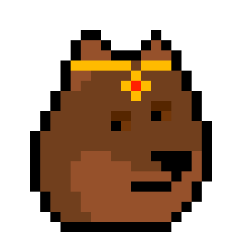
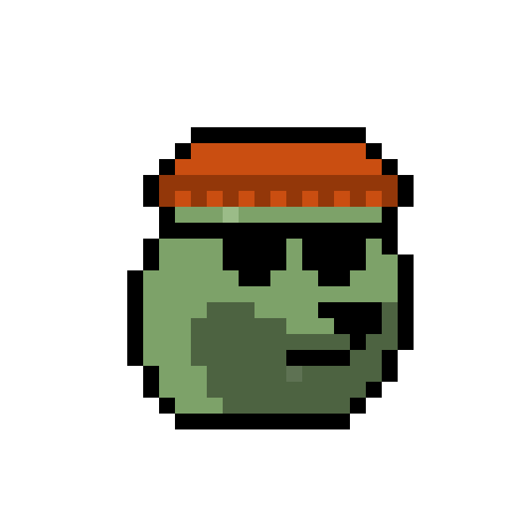

# Pixel Art Collection Quick Starter - Generate Algorithmically Your Own Curated Collection


Let's start and generate algorithmically a pixel art collection in three steps:

Step 1 - Generate A List of Your Pixel Art Collection in a Tabular Text Format (Spreadsheet)

Step 2 - Generate All Pixel Art Images in Original Format and In 20x

Step 3 - Bonus: Generate an All-In-One Composite Image


## Collection №1 -  Twenty-Five Dodge Pixel Art Punks

Let's start with an exclusive twenty-five Shiba Inu dogs
pixel art collection. Much wow. Super rare.

Let's copy and (re)use all punk (building) blocks
in the dodge series (32x32):

Classic ,
Dark ,
Zombie ,
Alien 

Attributes -
Beanie ,
Cap  ,
Knitted Cap ,
Cowboy Hat ,
Headband ,
Regular Shades  ,
Classic Shades ,
Small Shades  ,
Big Shades  ,
Eye Patch   ,
Nerd Glasses  ,
3D Glasses ,
Tiara 

(Source: [Punk (Building) Blocks - Dodge Series (32x32)](https://github.com/cryptopunksnotdead/punks.blocks#dodge-series-32x32))


### Step 1 -  Generate A List of Your Pixel Art Collection in Tabular Text Format (Spreadsheet)

In the first sample let's generate the list of the pixel art collection
by hand. Let's use a rarity & popularity distribution of
10 classic Shibas, 7 darkies, 5 zombies and 3 aliens.  Example  -  [`dodge.csv`](no1/dodge.csv):

``` csv
type,       attribute1,   attribute2
Classic,    3D Glasses
Classic,    Beanie
Classic,    Cap,          Regular Shades
Classic,    Cowboy Hat
Classic,    Eye Patch
Classic,    Knitted Cap
Classic,    Nerd Glasses
Classic,    Big Shades
Classic,    Knitted Cap,  Regular Shades
Classic
Dark,       Tiara
Dark,       Big Shades
Dark,       3D Glasses
Dark,       Classic Shades
Dark,       Cap
Dark,       Cap,          Regular Shades
Dark,       Tiara,        Big Shades
Zombie,     Knitted Cap
Zombie,     Eye Patch
Zombie,     Regular Shades
Zombie,     Knitted Cap,  Regular Shades
Zombie
Alien,      Cap,          Small Shades
Alien,      Headband
Alien,      Classic Shades
```

Yes, that's it.
For the list format let's use the comma-separated values (.CSV) format supported by all spreadsheet programs.
Every line is a record of a punk
made up of the basic type  and one or more attributes.

Note: Let's NOT add the index number (0,1,2,3, and so on).
Why? That way you can easily
reshuffle your collection anytime.
Let's try a more "random" look by hand:


``` csv
type,       attribute1,   attribute2
Classic,    3D Glasses
Dark,       Tiara
Classic,    Beanie
Zombie,     Knitted Cap
Alien,      Cap,          Small Shades
Dark,       Big Shades
Zombie,     Eye Patch
Classic,    Cap,          Regular Shades
Classic,    Cowboy Hat
Classic,    Eye Patch
Alien,      Headband
Classic,    Knitted Cap
Dark,       3D Glasses
Zombie,     Regular Shades
Classic,    Nerd Glasses
Classic,    Big Shades
Dark,       Cap
Zombie
Classic,    Knitted Cap,  Regular Shades
Classic
Dark,       Classic Shades
Dark,       Cap,          Regular Shades
Alien,      Classic Shades
Dark,       Tiara,        Big Shades
Zombie,     Knitted Cap,  Regular Shades
```


### Step 2  - Generate All Pixel Art Images in Original Format and In 20x


Now the "magic" let's read in the list
in the comma-separated values (.CSV) format
and generate all pixel art images in the original format
(32x32) and in 20x (640x640).


``` ruby
require './generate'


recs = read_csv( './no1/dodge.csv' )
puts "  #{recs.size} punk(s)"
#=>  25 records


art = Art.new( dir: './dodge' )

recs.each_with_index do |rec,i|
  name = "punk#{i}"
  punk = art.generate( rec )

  punk.save( "./o/no1/#{name}.png" )
  punk.zoom(20).save( "./o/no1/#{name}x20.png" )
end
```

Yes, that's it.
Run the script to generate algorithmically your collection.

In the `/o` directory you will now find
two images per punk (in the orginal format, that is, 32x32
and x20, that is, 640x640) and get:

```
no1/
  punk0.png
  punk0x20.png
  punk1.png
  punk1x20.png
  punk2.png
  punk2x20.png
  punk3.png
  punk3x20.png
  punk4.png
  punk4x20.png
  punk5.png
  punk5x20.png
  punk6.png
  punk6x20.png
  punk7.png
  punk7x20.png
  punk8.png
  punk8x20.png
  ...
```

Let's open up `punk0.png` to `punk24.png`:


And let's have a looksie at the biggie 20x versions:




[...]




Note: If you use your own artwork
make sure your type and attribute names
used in the list in the comma-separated values (.CSV) format
match the filenames (without the `.png` extension).
For the matching algorithm all names
get automatically downcased and all spaces deleted,
thus,
`Classic` will map to `classic.png` 
and `3D Glasses` to `3dglasses.png` 
and `Knitted Cap` to `knittedcap.png` 
and so on.


### Bonus: Step 3 -  Generate an All-In-One Composite Image

Let's generate an all-in-one composite image holding the complete
collection in a 5x5 grid.

``` ruby
require './generate'


recs = read_csv( './no1/dodge.csv' )
puts "  #{recs.size} punk(s)"
#=>  25 records


art = Art.new( dir: './dodge' )


## 5x5 grid with every tile 32x32
punks = CompositeImage.new( 5, 5, width: 32, height: 32 )

recs.each_with_index do |rec,i|
  punk = art.generate( rec )
  punks << punk
end

punks.save( './o/no1/punks.png')
```

Yes, that's it.
Run the script to generate algorithmically your collection
in an all-in-one composite.

Open up `punks.png` to have a looksie.


## Collection №2 -  One Hundred Pixel Art Punks

Let's take on a bigger pixel art collection.
Let's try one hundred punks in the classic 24x24
format...    To be continued...


## Questions? Comments?

Post them on the [CryptoPunksDev reddit](https://old.reddit.com/r/CryptoPunksDev). Thanks.


