# Pixel Art Collection Quick Starter - Generate Algorithmically Your Own Curated (or Randomized) Collection


Let's start and generate algorithmically a pixel art collection in three steps:

Step 1 - Generate A List of Your Pixel Art Collection in a Tabular Text Format (Spreadsheet)

Step 2 - Generate All Pixel Art Images in Original Format and In 20x

Step 3 - Bonus: Generate an All-In-One Composite Image


Sample Collections

- [Collection №1 -  Twenty-Five Dodge Pixel Art Punks](#collection-1----twenty-five-dodge-pixel-art-punks)
- [Collection №2 -  The First One Hundred Pixel Art Punks](#collection-2----the-first-one-hundred-pixel-art-punks)
- [Collection №3 -  The First One Hundred Pixel Art Punks - The Black & White (Pencil Drawing) Sketch Edition](#collection-3----the-first-one-hundred-pixel-art-punks---the-black--white-pencil-drawing-sketch-edition)


## Collection №1 -  Twenty-Five Dodge Pixel Art Punks

Let's start with an exclusive twenty-five Shiba Inu dogs
pixel art collection. Much wow. Super rare.

Let's copy and (re)use all punk (building) blocks
in the dodge series (24x24):

Classic ,
Dark 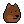,
Zombie 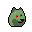,
Alien 

<!-- note:
  sort attributes a-z for now - why? why not?
-->

Attributes (by category and a-z):

- Hat  -
  Bandana ,
  Beanie 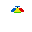,
  Cap  ,
  Cap Forward ,
  Cowboy Hat ,
  Fedora ,
  Headband ,
  Knitted Cap ,
  Tiara 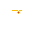,
  Top Hat 
- Hair -
  Crazy Hair 
- Eyes -
  3D Glasses ,
  Big Shades  ,
  Classic Shades ,
  Eye Patch   ,
  Nerd Glasses  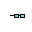,
  Regular Shades  ,
  Small Shades  


(Source: [Punk (Building) Blocks - Dodge Series (24x24)](https://github.com/cryptopunksnotdead/punks.blocks#dodge-series-24x24))


### Step 1 -  Generate A List of Your Pixel Art Collection in Tabular Text Format (Spreadsheet)

In the first sample let's generate the list of the pixel art collection
by hand. Let's use a rarity & popularity distribution of
10 classic Shibas, 7 darkies, 5 zombies and 3 aliens.  Example  -  [`dodge.csv`](no1/dodge.csv):

``` csv
type,       attribute1,   attribute2
Classic,    3D Glasses
Classic,    Beanie
Classic,    Cap,          Regular Shades
Classic,    Cowboy Hat
Classic,    Eye Patch
Classic,    Knitted Cap
Classic,    Nerd Glasses
Classic,    Big Shades
Classic,    Knitted Cap,  Regular Shades
Classic
Dark,       Tiara
Dark,       Big Shades
Dark,       3D Glasses
Dark,       Classic Shades
Dark,       Cap
Dark,       Cap,          Regular Shades
Dark,       Tiara,        Big Shades
Zombie,     Knitted Cap
Zombie,     Eye Patch
Zombie,     Regular Shades
Zombie,     Knitted Cap,  Regular Shades
Zombie
Alien,      Cap,          Small Shades
Alien,      Headband
Alien,      Classic Shades
```

Yes, that's it.
For the list format let's use the comma-separated values (.CSV) format supported by all spreadsheet programs.
Every line is a record of a punk
made up of the original type  and one or more attributes.

Note: Let's NOT add the index number (0,1,2,3, and so on).
Why? That way you can easily
reshuffle your collection anytime.
Let's try a more "random" look by hand:


``` csv
type,       attribute1,   attribute2
Classic,    3D Glasses
Dark,       Tiara
Classic,    Beanie
Zombie,     Knitted Cap
Alien,      Cap,          Small Shades
Dark,       Big Shades
Zombie,     Eye Patch
Classic,    Cap,          Regular Shades
Classic,    Cowboy Hat
Classic,    Eye Patch
Alien,      Headband
Classic,    Knitted Cap
Dark,       3D Glasses
Zombie,     Regular Shades
Classic,    Nerd Glasses
Classic,    Big Shades
Dark,       Cap
Zombie
Classic,    Knitted Cap,  Regular Shades
Classic
Dark,       Classic Shades
Dark,       Cap,          Regular Shades
Alien,      Classic Shades
Dark,       Tiara,        Big Shades
Zombie,     Knitted Cap,  Regular Shades
```


### Step 2  - Generate All Pixel Art Images in Original Format and In 20x


Now the "magic" let's read in the list
in the comma-separated values (.CSV) format
and generate all pixel art images in the original format
(24x24) and in 20x (480x480).


``` ruby
require './boot'


recs = read_csv( './no1/dodge.csv' )
puts "  #{recs.size} punk(s)"
#=>  25 punk(s)


art = Art.new( dir: './dodge' )

recs.each_with_index do |rec,i|
  name = "punk#{i}"
  punk = art.generate( rec )

  punk.save( "./o/no1/#{name}.png" )
  punk.zoom(20).save( "./o/no1/#{name}@20x.png" )
end
```

Yes, that's it.
Run the script to generate algorithmically your collection.

In the `/o` directory you will now find
two images per punk - in the orginal format, that is, 24x24
and 20x, that is, 480x480 - and get:

```
no1/
  punk0.png
  punk0@20x.png
  punk1.png
  punk1@20x.png
  punk2.png
  punk2@20x.png
  punk3.png
  punk3@20x.png
  punk4.png
  punk4@20x.png
  punk5.png
  punk5@20x.png
  punk6.png
  punk6@20x.png
  punk7.png
  punk7@20x.png
  punk8.png
  punk8@20x.png
  ...
```

Let's open up `punk0.png` to `punk24.png`:

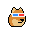
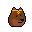
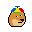
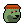

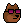
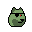
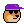
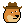
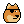

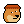
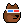

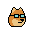
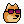
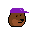
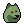

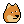
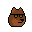
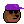

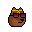


And let's have a looksie at the biggie 20x (480x480) versions:

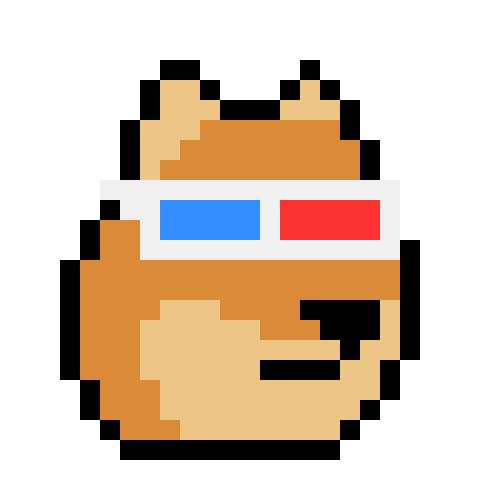


[...]

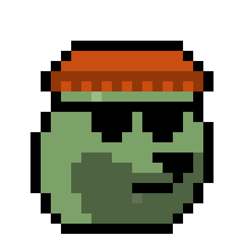


Note: If you use your own artwork
make sure your type and attribute names
used in the list in the comma-separated values (.CSV) format
match the filenames (without the `.png` extension).
For the matching algorithm all names
get automatically downcased and all spaces deleted,
thus,
`Classic` will map to `classic.png` 
and `3D Glasses` to `3dglasses.png` 
and `Knitted Cap` to `knittedcap.png` 
and so on.


### Step 3 - Bonus: Generate an All-In-One Composite Image

Let's generate an all-in-one composite image holding the complete
collection in a 5x5 grid.

``` ruby
require './boot'


recs = read_csv( './no1/dodge.csv' )
puts "  #{recs.size} punk(s)"
#=>  25 punk(s)


art = Art.new( dir: './dodge' )


## 5x5 grid with every tile 24x24
punks = CompositeImage.new( 5, 5 )

recs.each_with_index do |rec,i|
  punk = art.generate( rec )
  punks << punk
end

punks.save( './o/no1/punks.png')
```

Yes, that's it.
Run the script to generate algorithmically your collection
in an all-in-one composite.

Open up `punks.png` to have a looksie.

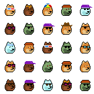


## Collection №2 -  The First One Hundred Pixel Art Punks

Let's take on a bigger pixel art collection.
Let's generate a pixel-perfect copy of the first one hundred punks in the original Larva Labs series in the classic 24x24
format.


Let's copy and (re)use all punk (building) blocks
in the basic series (24x24):

Male 1/2/3/4 


,
Female 1/2/3/4 


,
Zombie ,
Ape ,
Alien 

<!-- note:
  sort attributes a-z for now - why? why not?
-->

Attributes (by category and a-z):
- Hat -
  Bandana (m/f)
  
  ,
  Beanie (m)
  ,
  Cap (m/f)
  
  ,
  Cap Forward (m)
  ,
  Cowboy Hat (m)
  ,
  Do-rag (m)
  ,
  Fedora (m)
  ,
  Headband (m/f)
  
  ,
  Hoodie (m)
  ,
  Knitted Cap (m/f)
  
  ,
  Pilot Helmet (f)
  ,
  Police Cap (m)
  ,
  Tassle Hat (f)
  ,
  Tiara (f)
  ,
  Top Hat (m)
  
- Hair -
  Blonde Bob (f)
  ,
  Blonde Short (f)
  ,
  Clown Hair Green (m/f)
  
  ,
  Crazy Hair (m/f)
  
  ,
  Dark Hair (f)
  ,
  Frumpy Hair (m/f)
  
  ,
  Half Shaved (f)
  ,
  Messy Hair (m/f)
  
  ,
  Mohawk (m/f)
  
  ,
  Mohawk Dark (m/f)
  
  ,
  Mohawk Thin (m/f)
  
  ,
  Orange Side (f)
  ,
  Peak Spike (m)
  ,
  Pigtails (f)
  ,
  Pink With Hat (f)
  ,
  Purple Hair (m)
  ,
  Red Mohawk (f)
  ,
  Shaved Head (m)
  ,
  Straight Hair (f)
  ,
  Straight Hair Blonde (f)
  ,
  Straight Hair Dark (f)
  ,
  Stringy Hair (m/f)
  
  ,
  Vampire Hair (m)
  ,
  Wild Blonde (f)
  ,
  Wild Hair (m/f)
  
  ,
  Wild White Hair (f)
  
- Eyes -
  3D Glasses (m/f)
   
   ,
  Big Shades (m/f)
  
  ,
  Classic Shades (m/f)
  
  ,
  Eye Mask (m/f)
  
  ,
  Eye Patch (m/f)
  
  ,
  Horned Rim Glasses (m/f)
  
  ,
  Nerd Glasses (m/f)
  
  ,
  Regular Shades (m/f)
  
  ,
  Small Shades (m)
  ,
  VR (m/f)
  
  ,
  Welding Goggles (f)
  
- Eyes (Makeup) -
  Blue Eye Shadow (f)
  ,
  Clown Eyes Blue (m/f)
  
  ,
  Clown Eyes Green (m/f)
  
  ,
  Green Eye Shadow (f)
  ,
  Purple Eye Shadow (f)
  
- Blemishes -
  Mole (m/f)
   
   ,
  Rosy Cheeks (m/f)
   
   ,
  Spots (m/f)
   
   
- Nose -
  Clown Nose (m/f)
   
   ,
- Ears -
  Earring (m/f)
   
   
- Mouth -
  Buck Teeth (m)
   ,
  Frown (m)
   ,
  Smile (m)
   
- Mouth (Makeup) -
  Black Lipstick (f)
   ,
  Hot Lipstick (f)
   ,
  Purple Lipstick (f)
   
- Mouth Prop -
  Cigarette (m/f)
   
   ,
  Medical Mask (m/f)
   
   ,
  Pipe (m/f)
   
   ,
  Vape (m/f)
   
   
- Beard -
  Big Beard (m)
   ,
  Chinstrap (m)
   ,
  Front Beard (m)
   ,
  Front Beard Dark (m)
   ,
  Goat (m)
   ,
  Handlebars (m)
   ,
  Luxurious Beard (m)
   ,
  Mustache (m)
   ,
  Muttonchops (m)
   ,
  Normal Beard (m)
   ,
  Normal Beard Black (m)
   ,
  Shadow Beard (m)
   
- Neck Accessory -
  Choker (f)
   ,
  Gold Chain (m/f)
   
   ,
  Silver Chain (m/f)
   
   


<!-- break -->

(Source: [Punk (Building) Blocks - Basic Series (24x24)](https://github.com/cryptopunksnotdead/punks.blocks#basic-punks-series-2424))


Bonus - Let's add Laser Eyes (m) ,
Laser Eyes Gold (m) .


### Step 1 -  Generate A List of Your Pixel Art Collection in Tabular Text Format (Spreadsheet)

Let's again generate the list of the pixel art collection
by hand. Let's (re)use the rarity & popularity distribution of
the original series that starts with 56 males and 44 females.

Note: Let's use numbers for the four
male and female (arche)types
skintone variants, that is,
1 - darker, 2 - dark, 3 - light, 4 - lighter.
Example  -  [`punks.csv`](no2/punks.csv):

``` csv
type,        attribute1, attribute2, attribute3, attribute4, attribute5
Female 2, Earring, Blonde Bob, Green Eye Shadow
Male 1, Smile, Mohawk, Laser Eyes
Female 3, Wild Hair
Male 1, Wild Hair, Pipe, Nerd Glasses
Male 2, Goat, Earring, Wild Hair, Big Shades
Female 2, Earring, Half Shaved, Purple Eye Shadow
Male 2, Do-rag, Laser Eyes Gold
Female 2, Spots, Wild White Hair, Clown Eyes Blue
Male 1, Luxurious Beard, Messy Hair
Male 2, Big Beard, Police Cap, Clown Nose
Female 1, Mohawk, Blue Eye Shadow
Female 2, Black Lipstick, Straight Hair Dark, Clown Eyes Green
Female 1, Purple Lipstick, Blonde Short
Female 3, Black Lipstick, Straight Hair Blonde, Big Shades
Female 1, Hot Lipstick, Pilot Helmet, Pipe
Male 4, Luxurious Beard, Wild Hair, Regular Shades
Male 2, Earring, Stringy Hair, Small Shades
Male 3, Frown, Mohawk
Male 2, Muttonchops, Eye Mask
Female 1, Hot Lipstick, Bandana, Horned Rim Glasses
Male 3, Crazy Hair
Male 3, Earring, Messy Hair, Classic Shades
Female 1, Purple Lipstick, Pilot Helmet
Male 3, Handlebars, Earring, Do-rag
Male 3, Smile, Mohawk Dark
Female 1, Wild White Hair
Female 2, Dark Hair
Male 3, Earring, Peak Spike
Male 1, Crazy Hair, Big Shades
Female 2, Earring, Half Shaved, Horned Rim Glasses
Male 1, Normal Beard Black, Cap
Female 1, Stringy Hair
Male 3, Frown, VR
Male 3, Peak Spike
Female 3, Purple Lipstick, Frumpy Hair
Male 1, Normal Beard, Earring, Peak Spike, Cigarette, Horned Rim Glasses
Female 2, Red Mohawk
Female 1, Cap, Clown Eyes Blue
Female 3, Purple Lipstick, Frumpy Hair, Classic Shades
Male 3, Frown, Shaved Head, Regular Shades
Male 3, Smile, Chinstrap, Bandana
Male 1, Muttonchops, Wild Hair, Clown Eyes Green
Female 1, Wild Hair, Cigarette
Female 2, Half Shaved
Male 3, Messy Hair
Male 2, Mole, Earring
Female 2, Purple Lipstick, Straight Hair Dark
Male 1, Knitted Cap
Male 3, Mohawk, Big Shades
Female 1, Bandana, Purple Eye Shadow
Male 2, Spots, Fedora
Male 2, Muttonchops, Earring, Wild Hair
Male 1, Shadow Beard, Earring, Knitted Cap, Nerd Glasses
Female 3, Straight Hair, Big Shades
Male 1, Hoodie
Male 3, Eye Patch
Male 1, Shaved Head
Male 3, Headband
Male 2, Normal Beard Black, Hoodie
Male 4, Muttonchops, Cowboy Hat
Female 3, Purple Lipstick, Stringy Hair
Female 3, Dark Hair
Female 1, Hot Lipstick, Earring, Mohawk Dark, Clown Eyes Blue
Male 1, Earring, Shaved Head, Small Shades
Female 2, Purple Lipstick, Straight Hair Blonde
Female 2, Headband, Eye Mask
Female 1, Tassle Hat
Female 1, Purple Lipstick, Half Shaved, 3D Glasses
Male 1, Do-rag, Nerd Glasses
Male 2, Normal Beard Black, Fedora
Female 2, Earring, Crazy Hair, Cigarette, Regular Shades
Female 3, Purple Lipstick, Half Shaved, Green Eye Shadow
Male 1, Normal Beard, Earring, Fedora, Nerd Glasses
Female 2, Black Lipstick, Earring, Bandana
Male 1, Shadow Beard, Earring, Mohawk Dark
Male 3, Shadow Beard, Knitted Cap, Eye Patch
Male 3, Do-rag, Cigarette
Male 1, Handlebars, Stringy Hair
Male 2, Handlebars, Knitted Cap, Eye Patch
Male 1, Normal Beard, Mohawk Dark
Male 4, Mustache, Wild Hair
Male 3, Headband, Small Shades
Male 4, Headband
Male 3, Shaved Head, Vape, Small Shades
Male 3, Earring, Messy Hair, Big Shades
Female 1, Crazy Hair
Female 1, Hot Lipstick, Earring, Knitted Cap, Green Eye Shadow
Male 3, Earring, Hoodie
Female 3, Hot Lipstick, Cap
Female 1, Choker
Male 2, Hoodie, Eye Patch
Female 3, Straight Hair, Clown Nose
Female 3, Purple Lipstick, Pink With Hat, Nerd Glasses
Female 3, Bandana
Female 1, Earring, Pink With Hat, Regular Shades
Male 2, Earring, Mohawk
Female 3, Blonde Bob
Male 2, Wild Hair
Female 3, Black Lipstick, Dark Hair, Welding Goggles
Male 2, Hoodie, Cigarette
```

Note - see if you can spot the never-befor-seen super rare punks
with Laser Eyes and Laser Eyes Gold.


### Step 2  - Generate All Pixel Art Images in Original Format and In 20x

Now the "magic" let's read in the list
in the comma-separated values (.CSV) format
and generate all pixel art images in the original format
(24x24) and in 20x (480x480).


``` ruby
require './boot'


recs = read_csv( './no2/punks.csv' )
puts "  #{recs.size} punk(s)"
#=>  100 punk(s)

art = Art.new( dir: './basic',
               qualifier: { 'm' => ['Male 1', 'Male 2', 'Male 3', 'Male 4',
                                    'Zombie',
                                    'Ape',
                                    'Alien'],
                            'f' => ['Female 1', 'Female 2', 'Female 3', 'Female 4'],
                          }
             )

recs.each_with_index do |rec,i|
  name = "punk#{i}"
  punk = art.generate( rec )

  punk.save( "./o/no2/#{name}.png" )
  punk.zoom(20).save( "./o/no2/#{name}@20x.png" )
end
```

Note: The attributes (see above) come
in two editions, that is,  m - male (stored in the `/m` directory)
and f - female (stored in the `/f` directory).
To map the attribute (or "qualify"
the name with an extra auto-added directory)
let's configure
the "qualifier" by archetype, that is,
Male 1/2/3/4, Zombie, Ape and Alien will auto-add the `/m` directory
to the attribute image lookup and
Female 1/2/3/4 will aut-add the `/f` directory.


Yes, that's it.
Run the script to generate algorithmically your collection.

In the `/o` directory you will now find
two images per punk - in the orginal format, that is, 24x24
and 20x, that is, 480x480 - and get:

```
no2/
  punk0.png
  punk0@20x.png
  punk1.png
  punk1@20x.png
  punk2.png
  punk2@20x.png
  punk3.png
  punk3@20x.png
  punk4.png
  punk4@20x.png
  punk5.png
  punk5@20x.png
  punk6.png
  punk6@20x.png
  punk7.png
  punk7@20x.png
  punk8.png
  punk8@20x.png
  ...
```

Let's open up `punk0.png` to `punk99.png`:


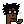
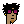


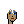
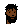
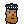
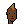
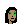
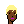

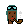
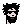
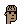
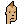
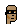
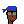
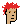
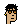
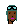

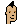
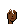
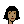
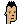
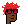
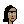


And let's have a looksie at the biggie 20x (480x480) versions:


[...]


### Step 3 - Bonus: Generate an All-In-One Composite Image

Again let's generate an all-in-one composite image holding the complete
collection in a 10x10 grid.

``` ruby
require './boot'


recs = read_csv( './no2/punks.csv' )
puts "  #{recs.size} punk(s)"
#=>  100 punk(s)


art = Art.new( dir: './basic',
               qualifier: { 'm' => ['Male 1', 'Male 2', 'Male 3', 'Male 4',
                                    'Zombie',
                                    'Ape',
                                    'Alien'],
                            'f' => ['Female 1', 'Female 2', 'Female 3', 'Female 4'],
                          }
             )


## 10x10 grid with every tile 24x24
punks = CompositeImage.new( 10, 10 )

recs.each_with_index do |rec,i|
  punk = art.generate( rec )
  punks << punk
end

punks.save( './o/no2/punks.png')
```

Yes, that's it.
Run the script to generate algorithmically your collection
in an all-in-one composite.

Open up `punks.png` to have a looksie.


## Collection №3 -  The First One Hundred Pixel Art Punks - The Black & White (Pencil Drawing) Sketch Edition

Let's redo the the first one hundred pixel art punks collection
and let's pick a pixel art special effect.

Tip:  See [**Pixel Art Special Effects Gallery / Cheatsheet - Free Ideas & Recipes for Starting Your Own CryptoPunks Collection Today**](https://github.com/cryptopunksnotdead/programming-cryptopunks/blob/master/A1_special_effects.md)
in the free (online) Programming CryptoPunks & Copypasta Step-by-Step Book(let).


### Step 1 -  Generate A List of Your Pixel Art Collection in Tabular Text Format (Spreadsheet)

Same as in collection №2 above.
Let's (re)use [`punks.csv`](no3/punks.csv).


### Step 2  - Generate All Pixel Art Images in Original Format and In 20x


Same as in collection №2 above.
Plus let's try the black & white (pencil drawing) sketch special effect.


``` ruby
#  [..]

recs.each_with_index do |rec,i|
  name = "punk#{i}"
  punk = art.generate( rec )

  punk_sketch = punk.sketch( 1, line: 1 )
  punk_sketch.save( "./o/no3/#{name}.png" )

  punk_sketch = punk.sketch( 20, line: 4 )
  punk_sketch.save( "./o/no3/#{name}@20x.png" )
end
```

Note: The minimum format for a black & white (pencil drawing) sketch
is 49x49px (24\*1 + 25\*1 = 49px), that is,  24 "inner" white pixels and 25 "outline" black pixels.
And the 20x version becomes 580x580px (20\*24 + 4\*25 = 580px),
that is, with a 24\*20 "inner"
white pixel and 25\*4 "outline" black pixels.


Yes, that's it.
Run the script to generate algorithmically your collection.

In the `/o` directory you will now find
two images per punk - in the orginal format, that is, 49x49
and 20x, that is, 580x580 - and get:

```
no3/
  punk0.png
  punk0@20x.png
  punk1.png
  punk1@20x.png
  punk2.png
  punk2@20x.png
  punk3.png
  punk3@20x.png
  punk4.png
  punk4@20x.png
  punk5.png
  punk5@20x.png
  punk6.png
  punk6@20x.png
  punk7.png
  punk7@20x.png
  punk8.png
  punk8@20x.png
  ...
```

Let's open up `punk0.png` to `punk99.png`:


And let's have a looksie at the biggie 20x (580x580) versions:


[...]


### Step 3 - Bonus: Generate an All-In-One Composite Image

Same as in collection №2 above.
Plus let's try the black & white (pencil drawing) sketch special effect.


``` ruby
#  [..]

## 10x10 grid with every tile 49x49
punks = CompositeImage.new( 10, 10, width: 49, height: 49 )

recs.each_with_index do |rec,i|
  punk = art.generate( rec )

  punk_sketch = punk.sketch( 1, line: 1 )

  punks << punk_sketch
end

punks.save( './o/no3/punks.png')
```

Yes, that's it.
Run the script to generate algorithmically your collection
in an all-in-one composite.

Open up `punks.png` to have a looksie.


To be continued...


## Appendix


### Frequently Asked Questions (F.A.Qs)

**Q:  Can I use a different pixel format for the collection e.g. 16x16 (instead of the classic 24x24)?**

A: Yes,  it works with any square pixel size (e.g. 16x16, 24x24, 32x32).
Note: If you use the `CompositeImage` the default width x height is set to 24 x 24 - if you use a different size
you have to pass in width and height e.g.

``` ruby
# 5x5 grid with every tile 16x16
composite = CompositeImage.new( 5, 5, width: 16, height: 16 )
```

**Q: I am trying to make a composite of 30 variations with a base size of 125x125 px each. I can't seem to figure out how to adjust the settings to make it generate a composite without all of the results overlapping each other. Any ideas?**

The CompositeImage defaults to width: 24, height: 24, thus, if you use a different dimension / canvas
you have to pass along the "custom" width and height.
Example with a 10x3 grid (equal to 30 tiles / variations)  and 125x125 width x height:

``` ruby
composite = CompositeImage.new( 10, 3, width: 125, height: 125 )
```


### Troubleshooting


**Q: I cannot get the `./generate.rb` script to run [in Powershell / in Sublime / in ...]?**

A: Make sure you run the script in the "top-level", that is, `/punks.starter` and you use `no1/generate.rb` or `no2/generate.rb` or `no3/generate.rb`:

```
/punks.starter
   boot.rb
   /no1
      dodge.csv
      generate.rb
   /no2
      punks.csv
      generate.rb
   /no3
      punks.csv
      generate.rb
```

And run inside the `/punks.starter` directory:

```
$ ruby no1/generate.rb          # start in /punks.starter
```


**Q: When running `ruby no1/generate.rb` (in /punks.starter) I get the error `wrong number of arguments (given 2, expected 1) (ArgumentError)` after upgrading to ruby 3.x, before that all was fine, please help.**

```
punks.starter> $ ruby no1/generate.rb
pixelart/0.2.2 on Ruby 3.0.2 (2021-07-07)
  csvreader-1.2.4/lib/csvreader/parser_std.rb:116:in `parse': wrong number of arguments (given 2, expected 1) (ArgumentError)
    [...]
    from punks.starter/generate.rb:8:in `read_csv'
    from no1/generate.rb:10:in `<main>'
```


A: Sorry for the trouble -  this is a known issue / bug -
the scripts run only on the ruby 2.x series for now.
This is a ruby 3.x non-backwards-compatibility issue (with keyword arguments) that needs to get fixed.
If you can downgrade to the 2.x series and retry.

To check that reading your .csv dataset works use something like (save as `testcsv.rb` in `/punks.starter`,
for example and run as `ruby ./testcsv.rb`):

``` ruby
require 'csvreader'

def read_csv( path )
  CsvHash.read( path )
end

recs = read_csv( './no1/dodge.csv' )
puts "  #{recs.size} record(s)"
#=>  25 record(s)
```

Of course you might change `dodge.csv` to `punks.csv` or such and the record size will be different
depending on how many records you have and so on.


## Questions? Comments?

Post them on the [CryptoPunksDev reddit](https://old.reddit.com/r/CryptoPunksDev). Thanks.


